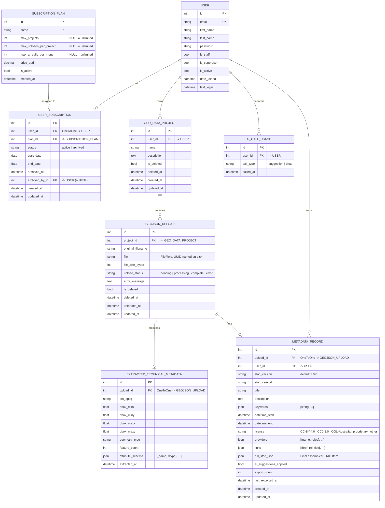

# GeoMetaAssist — Database Schema

Entity-relationship diagram for the GeoMetaAssist Django models.
View this file in VS Code with the Mermaid extension, or paste the
diagram block into https://mermaid.live to render an SVG/PNG.

## ER Diagram

## Relationship summary

| Relationship | Type | From | To |
|---|---|---|---|
| User → UserSubscription | 1:1 (optional) | accounts.User | billing.UserSubscription |
| SubscriptionPlan → UserSubscription | 1:N | billing.SubscriptionPlan | billing.UserSubscription |
| User → AICallUsage | 1:N | accounts.User | billing.AICallUsage |
| User → GeoDataProject | 1:N | accounts.User | projects.GeoDataProject |
| GeoDataProject → GeoJSONUpload | 1:N | projects.GeoDataProject | projects.GeoJSONUpload |
| GeoJSONUpload → ExtractedTechnicalMetadata | 1:1 | projects.GeoJSONUpload | metadata.ExtractedTechnicalMetadata |
| GeoJSONUpload → MetadataRecord | 1:1 | projects.GeoJSONUpload | metadata.MetadataRecord |
| User → MetadataRecord | 1:N | accounts.User | metadata.MetadataRecord |

## Notes

- All foreign keys cascade on delete except `UserSubscription.plan` (PROTECT)
  and `UserSubscription.archived_by` (SET_NULL).
- Soft delete: `GeoDataProject.is_deleted` and `GeoJSONUpload.is_deleted`
  are flags; rows are never hard-deleted in normal flows.
- The actual file content for a `GEOJSON_UPLOAD` lives on disk under
  `MEDIA_ROOT/geojson/<uuid>.geojson` — the `file` column stores the path.
- `ExtractedTechnicalMetadata` and `MetadataRecord` are both created
  automatically by `metadata/extractor.py` once an upload's extraction
  completes, so they exist whenever `upload_status == 'complete'`.
- AI call quota is enforced by counting `AI_CALL_USAGE` rows for the
  current calendar month against `SubscriptionPlan.max_ai_calls_per_month`.
